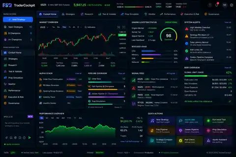
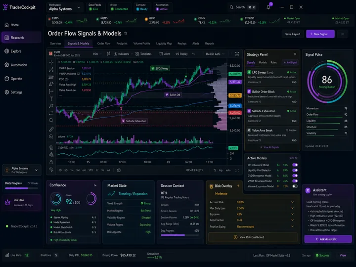
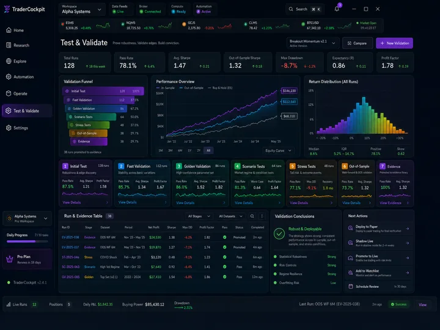
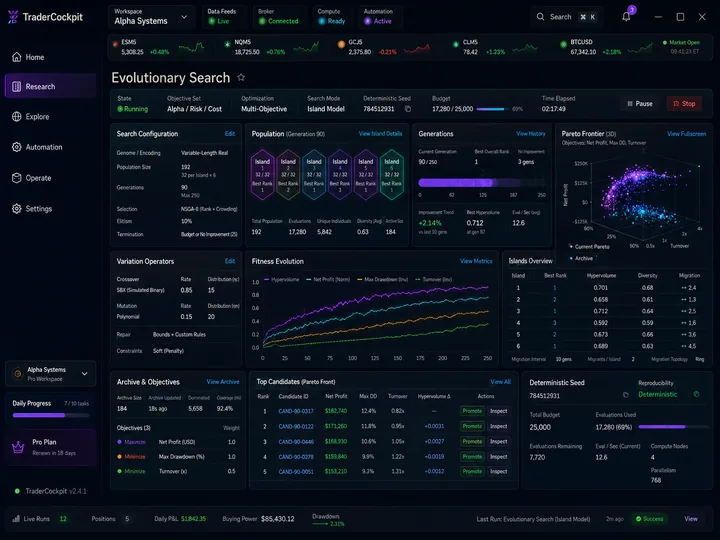
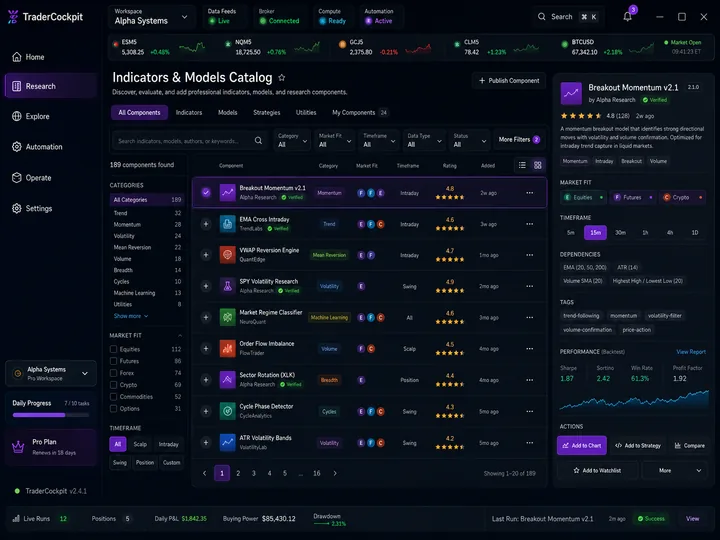

# TraderCockpitSQ — Fable 5.1 Recovery Handoff

## STOP: do not invent another interface

The repository already had an explicitly pinned and accepted UI authority. The immediate recovery task is to restore that authority, understand why it disappeared from the active product line, and reconnect the current backend work to it.

Do **not** use PR #74's Capability Cockpit as the product-design authority. Do **not** use the temporary SVG mockups that were created during this recovery handoff; those have been removed. Do **not** create another dashboard to explain the backend.

The accepted visual authority is repository history, not a new design exercise.

---

# 1. Actual recovered UI authority

Historical commit `1391251c65a5181d0825b99890350cb1f0abc926` is titled:

> `Pin canonical TraderCockpit UI prototype lineage`

That commit explicitly states:

> **The multicolor ESQ TraderCockpit/Cursor-era prototype is the frontend product authority. It supersedes the earlier dark-blue Chart / Backtest / Proof shell as a product baseline.**

Historical commit `813ff7327935828129354aec5311cf231ca7a9e5` is titled:

> `Add prototype UI previews for desktop agent`

It added repository-native visual previews and told desktop/frontend agents to open them before changing frontend framing.

Historical commit `725caab3e295cd1fd1d865c6f81195dc81c853e8` is titled:

> `Consolidate accepted UI authority`

Historical commit `75fc0b29af06b418b5f5143f08050d0dda10eb86` is titled:

> `Finalize repository cleanup authority`

That cleanup document still named the retained UI authority branch:

`codex/ui-prototype-authority@53645acfff750672805efd6b20623a0abf36dff1`

Historical commit `cb8b52713752777fadabe4ea4aef8d2f6e717ea3` later made the **accepted TraderCockpit prototype** active implementation authority alongside observed SQX behavior.

This means the present UI problem is not that no approved visual direction existed. It existed, was pinned, was consumed by product work, and later disappeared from the current repository tree / product framing.

That disappearance is a repository-integrity failure that Fable must trace.

---

# 2. The actual pictures

The recovered authority previews are restored in this branch at:

`references/ui-authority/previews/`

The exact full-resolution PNG identities, expected sizes and SHA-256 digests are restored in:

`references/ui-authority/manifest.json`

The historical agent instructions are restored in:

`references/ui-authority/DESKTOP_AGENT.md`

The authority explanation is restored in:

`references/ui-authority/README.md`

## 2.1 Cockpit Home

This is the accepted visual lineage for the launch/cockpit surface. Do not substitute the recent plain dark-blue Home implementation merely because it is what `main` currently renders.

## 2.2 Strategy / Signals & Models

This establishes the trading/research workspace grammar: chart-centric working context, signals/models, confluence/history/market state, and persistent assistant interaction.

## 2.3 Test & Validate

This establishes the validation-product direction including Initial Test, Fast/Golden validation concepts, stress/scenario/OOS visibility, validation funneling and evidence presentation.

## 2.4 Evolutionary Search

This is the visual authority for evolutionary/search depth: population, generations, mutation, Pareto selection, deterministic seed/budget, fitness evolution, archive/islands/objectives, and candidate review.

## 2.5 Indicators & Models Catalog

This is the visual authority for research capability discovery and integration rather than a raw technical field dump.

---

# 3. Additional recovered visual artifacts

The user file library also contains later visual artifacts that must be reviewed during recovery rather than ignored:

- `TraderCockpit Home Approval Board.png`
- `Trader Cockpit Workflow Spec.png`
- `Strategy Quant X Research Workstation.png`
- `TraderCockpit-clickable-prototype.html`

The Home Approval Board presents a unified Home with Research, Build & Backtest, Prop Firm Simulation, Proof & Evidence, active builds, candidate review, system health and a persistent assistant.

The Workflow Spec presents the product as:

`IDEA → CONSTRUCT → BUILD → CANDIDATES → BACKTEST → ROBUSTNESS → PROOF → DELIVERY / SIMULATION`

with progressive drill-down rather than a shallow dashboard.

The Research Workstation presents a detailed SQX-backed construction surface with Simple / Detailed / Native disclosure, Rule Space, Genetic Evolution vs Random Discovery, Selection, Validation and native-oriented controls.

These later artifacts are **supporting recovery evidence**. Fable must determine their relationship to the pinned repository authority and the user's subsequent approval decisions. Do not silently replace the pinned five-screen lineage with one of them without establishing that chronology.

---

# 4. What went wrong

Current `main` is:

`ea567c32148947d614cb8514c7505abb5d531409`

The visible desktop on current `main` shows a much simpler dark Home shell and Research surfaces that do not visually resemble the pinned multicolor product authority.

A recent attempt to fix this created PR #74, `Home: replace stale dashboard orientation with capability cockpit`. That PR changes the old Home into a capability inventory / workflow map.

That was the wrong level of correction. The core question was never “how should we decorate the current Home?” The core question is:

> **Why is the accepted canonical UI lineage no longer the product UI, and how did development continue without enforcing that visual authority?**

Fable must trace:

1. where `references/ui-authority/**` left the active tree;
2. where the accepted UI composition was replaced or simplified;
3. which commits/PRs deliberately superseded UI behavior versus accidentally discarded it;
4. whether later architecture documents incorrectly elevated the simplified Home shell to canonical authority;
5. which current backend components can be connected into the accepted UI without loss;
6. which current browser/desktop tests are preserving the wrong interface.

---

# 5. Current open work to audit

## PR #72 — Research: complete end-to-end vertical

- Base: `main`
- Head: `c12b50a7f30b58d4036b015739bfddfb7f1417aa`
- Large Research integration branch.
- Claims 20 capability families: 12 mapped, 8 explicitly unavailable, 0 silently unmapped.
- Contains substantial custody/native execution/readback work that is likely worth preserving.

Do not equate its capability-map completeness with completion of the accepted UI.

## PR #74 — Home capability cockpit

- Head: `50d847c7091ad0a048b9df832c08a0fc4be8dfeb`
- Stacked on PR #72.
- Created in response to the old dashboard problem.

Treat this as a temporary corrective experiment. It is **not** the historical UI authority and should not become one merely because it is newer.

## PR #73 — Cloud Agent environment

- Draft.
- Head: `f948cf70f454e10b974116918aac777a4d43b258`
- Based on `codex/sqx-engine-extract`, not current `main`.

Audit/recreate only if useful.

## PR #75 — this recovery evidence PR

This PR should contain only recovery evidence and the actual restored canonical preview set. It must not introduce a new UI design.

---

# 6. Product end goal

The target is a finished TraderCockpit desktop product that:

- the owner can use personally every day;
- presents the complete useful backend/native capability through one coherent interface;
- uses StrategyQuant X for native quantitative semantics it owns;
- is easier to operate than SQX while preserving SQX behavior/capability depth;
- preserves exact provenance, custody and reproducibility;
- supports robust historical research, candidate generation, testing, robustness, Proof, delivery/simulation and later live operation;
- is installable, recoverable and understandable without repository knowledge;
- can be packaged, licensed, supported and sold publicly.

The repository must stop optimizing for isolated accepted slices if those slices do not assemble into that product.

---

# 7. Architecture that should be preserved unless concrete defects are found

## One product family

Preserve:

- one canonical Python application server;
- one canonical web product UI;
- one desktop host around that same server/UI;
- one custody/state family;
- one native SQX runtime/gateway family;
- one product identity chain.

Do not create a second frontend/server/product spine to bypass integration difficulty.

## SQX owns native quantitative semantics

Where proven, SQX owns:

- Builder generation/search;
- Genetic Evolution mechanics;
- native rule/block semantics;
- historical backtesting;
- ranking/filter calculations;
- Retester;
- robustness/cross-check methods;
- optimization / Walk-Forward;
- Custom Project task behavior;
- native strategy/result artifacts.

TraderCockpit owns:

- user experience;
- orchestration around real producer seams;
- custody/provenance;
- configuration mapping/review/approval;
- runtime verification/control;
- Candidate/Backtest/Proof presentation;
- durable product identities/state;
- account/provider/model boundaries;
- structured unavailable/error states.

A missing SQX seam does not authorize a replacement TraderCockpit quantitative algorithm.

## Installed SQX is executable authority

When the authorized installed SQX runtime is available, run and inspect it. Screenshots, saved projects/configurations, process behavior and result artifacts are primary integration evidence. Retained/decompiled source is secondary support for non-observable details.

## Keep three integrity concepts separate

1. runtime trust;
2. artifact custody / exact identity;
3. producer validity.

Hashes identify bytes. They do not make one archived user project the only valid mutable project.

---

# 8. Backend work that appears valuable and should be salvaged

Recent Research work appears to include:

- immutable Idea/source revisions;
- exact Builder configuration capture;
- compile/review/approve custody;
- trusted native Builder launch;
- durable native-job receipts;
- exact Builder Results capture;
- Candidate import bound to native output;
- native Retester execution/readback;
- Backtest Overview;
- Backtest Trades from native producer records;
- Backtest Configuration ancestry;
- producer-backed Higher Precision robustness;
- Proof;
- restart/reopen preservation;
- preset/config/project-topology inspection;
- capability inventory / explicit unavailable boundaries.

Do not throw away correct backend/custody work because the UI went off course. Reconnect it to the accepted product surface.

---

# 9. Fable 5.1 recovery sequence

## Phase A — Freeze feature coding

Allow already-running CI/reviews to complete for evidence, but do not merge based solely on their result.

Inventory all PRs and branches. Record exact SHAs.

Classify every active branch as:

`CANONICAL CANDIDATE | STACKED | EVIDENCE | STALE | SUPERSEDED | ENVIRONMENT-ONLY | CLOSE`

## Phase B — Reconstruct UI chronology

Start with these exact historical anchors:

- `1391251c65a5181d0825b99890350cb1f0abc926`
- `813ff7327935828129354aec5311cf231ca7a9e5`
- `725caab3e295cd1fd1d865c6f81195dc81c853e8`
- `75fc0b29af06b418b5f5143f08050d0dda10eb86`
- `cb8b52713752777fadabe4ea4aef8d2f6e717ea3`
- retained `codex/ui-prototype-authority@53645acfff750672805efd6b20623a0abf36dff1`
- retained `codex/ui-reference-acceptance@26221dccee1541c1fc672f24b75a380cf4371c32`
- accepted Signals composition `codex/ui-signals-models-authority@9086e19e33d5a1f8526d4eb3f8e99d38014db586`

Determine exactly where the accepted lineage was lost or intentionally superseded.

## Phase C — Run all relevant candidates visually

Run and capture:

- current `main`;
- PR #72;
- PR #74;
- historical accepted UI branch / composition where runnable.

Use the same viewport and key workflows for side-by-side comparison.

Do not evaluate only HTML structure or route coverage.

## Phase D — Build a backend-to-accepted-UI matrix

For every current backend capability/action/read model, identify where it belongs in the accepted product UI.

Required matrix:

| Capability | Backend producer | Read/action seam | Runtime status | Accepted UI destination | Current UI destination | Gap / correction |
|---|---|---|---|---|---|---|

Do not use a frontend manifest as the sole source of backend truth.

## Phase E — Restore one product authority

After chronology and matrix review:

- restore/update the canonical visual/product authority;
- connect good backend work;
- remove or supersede the simplified UI architecture where it conflicts;
- update tests to prove the accepted product, not the accidental replacement;
- update README / AGENTS / architecture / backbone / living plan so all point to the same product.

---

# 10. Canonical documentation repair

The final repository should have one authority for each:

## Product specification

Define:

- user;
- personal-use goal;
- commercial goal;
- main workflows;
- accepted visual lineage;
- what “finished” means;
- SQX vs TraderCockpit ownership;
- customer onboarding and lifecycle requirements.

## Architecture

Define:

- one app/runtime family;
- producer boundaries;
- custody/identity/security;
- account/provider/model architecture;
- live vs historical scope;
- extension capability model;
- packaging/update/observability/privacy expectations.

## Roadmap

Use product milestones, not hundreds of locally optimizable checkboxes.

Recommended milestones:

1. Repository/UI authority recovery.
2. Research product assembled on accepted UX.
3. Daily personal-use reliability.
4. Live/Operate capability.
5. Automation/capability expansion.
6. Commercial readiness.
7. Public beta/release.

Each milestone needs a real packaged-desktop user-journey exit criterion.

## AGENTS.md

Every coding agent must be forced to inspect the canonical visual authority for UI-impacting work and must not substitute a new design without an explicit product-authority change.

## README

Describe what the repository actually contains after recovery. Remove stale baseline claims.

---

# 11. Commercial-readiness requirements that must appear in the roadmap

The project is not complete when Research works.

Audit/roadmap at minimum:

- clean-machine installer;
- supported OS/version matrix;
- code signing;
- updater / rollback;
- configuration/data migrations;
- backup/export/import;
- crash recovery and diagnostics bundle;
- secrets/credential storage;
- account/license/auth;
- subscription/entitlement/payment boundaries;
- first-run onboarding;
- SQX discovery/setup/version compatibility;
- customer-readable errors;
- documentation/support;
- privacy/telemetry policy;
- release/version channels;
- legal/licensing review for SQX integration/distribution boundaries.

---

# 12. Acceptance model going forward

A meaningful product feature/vertical is complete only when all applicable layers pass:

1. **Producer truth** — real SQX where SQX owns behavior.
2. **Contract truth** — explicit typed/custody/action contracts.
3. **Runtime truth** — actual server/native behavior.
4. **Presentation truth** — accepted UI visibly exposes it.
5. **Persistence truth** — relevant state survives restart.
6. **Packaged-desktop truth** — frozen Windows desktop shows the intended product state.
7. **User-journey truth** — owner can perform the task without repository/route knowledge.
8. **Visual authority review** — meaningful UX change compared with approved baseline.
9. **Exact-head CI/review** — correctness gates pass on the same SHA.

Passing tests does not authorize replacing the product design.

---

# 13. Questions Fable must answer before feature coding resumes

1. Where exactly was the pinned UI authority removed from the active tree?
2. Was that removal intentional, and if so who/what document authorized the replacement?
3. Which current UI files diverge from the accepted screens?
4. Which browser tests are now locking in the replacement UI rather than the accepted UI?
5. Which parts of PR #72 are backend-complete but not product-complete?
6. Should PR #74 be closed, mined for useful mechanics, or retained temporarily?
7. What is the canonical first-launch experience after restoring the UI authority?
8. How does the accepted visual lineage incorporate the current SQX-native Research workflow?
9. Which current backend capabilities are not visible in the accepted interface yet?
10. Which accepted-screen capabilities are not implemented in the current backend yet?
11. What is the shortest path to a personally usable daily desktop?
12. What remains after that for a sellable beta?

---

# 14. Required Fable deliverables

1. **Repository audit report** with keep/fix/remove decisions.
2. **PR/branch disposition** for #72, #74, #73 and all retained UI authority branches.
3. **UI chronology report** explaining how canonical visual authority was lost.
4. **Backend-to-accepted-UI coverage matrix**.
5. **Canonical documents repaired**: product spec, architecture, roadmap, AGENTS, README.
6. **Actual desktop screenshots** comparing current main with recovered authority-driven implementation.
7. **Integration/cleanup PR** that reconnects correct backend work to the accepted product UI.
8. **Final handback** with exact main SHA, tests, screenshots, blockers and next three coherent implementation lanes.

---

# 15. Final instruction

The repository already knew what TraderCockpit was supposed to look and behave like. The recovery job is not to imagine a new product.

Recover the accepted authority, determine why it was lost, preserve correct backend work, and make code, UI, tests, documentation, roadmap and packaged desktop describe the same product again.
