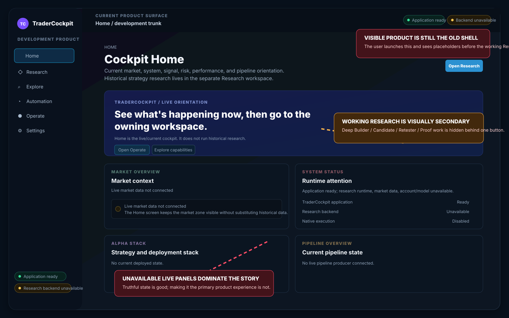
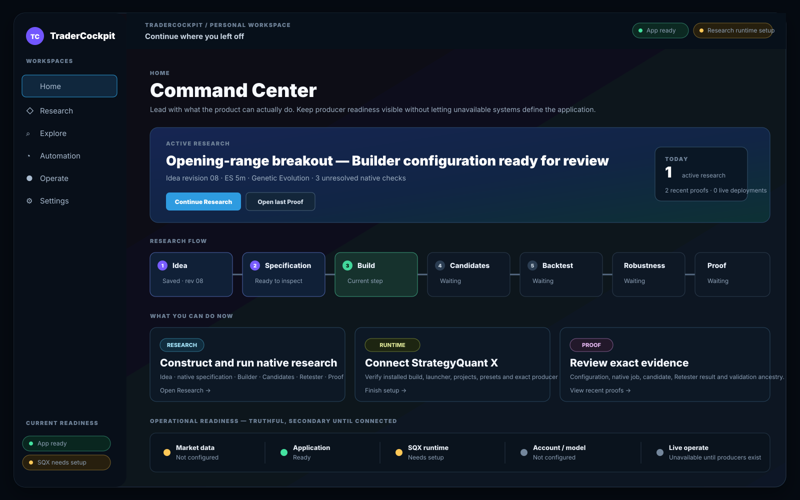
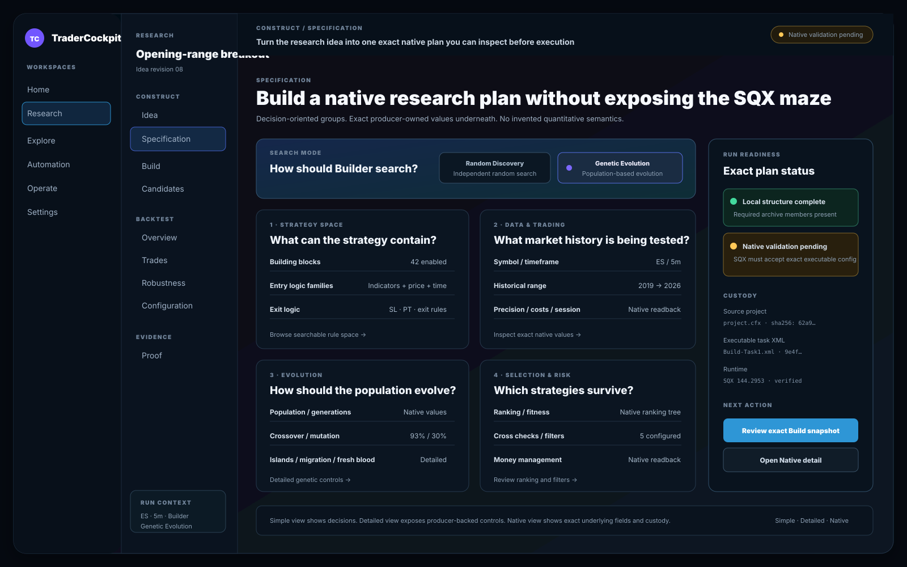
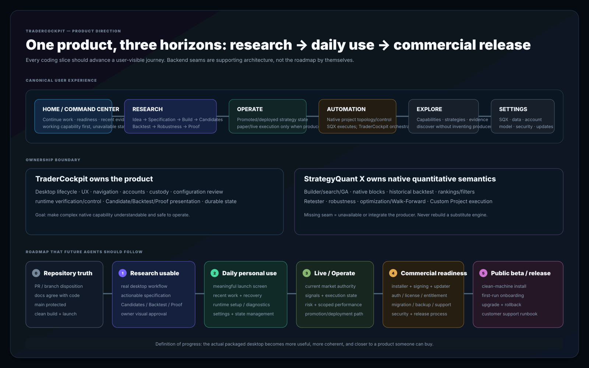

# TraderCockpitSQ — Fable 5.1 Recovery Handoff

**Purpose:** audit the whole repository and product, restore one coherent product direction, reconcile the UI with the backend capability that has actually been built, and rewrite the canonical plan/spec/roadmap so future coding moves toward a finished personal-use product and then a sellable public product.

This handoff is intentionally **visual**. Do not treat text, tests, capability manifests, or PR descriptions as sufficient proof that the product is on track.

## 1. The problem in one picture

The immediate failure is not “no backend work exists.” The failure is that the application can contain deep Research work while the first visible product still looks like an old live-dashboard shell dominated by unavailable market/risk/signal placeholders.

That makes a large amount of implemented Research capability effectively invisible to the owner.

## 2. Product direction to evaluate

The next UI should lead with **what the user can actually do**, while preserving producer readiness as truthful secondary status.

This is a design-intent mockup, not a command to preserve every pixel:

The key ideas are:

- launch into a useful command center rather than an unavailable-state dashboard;
- expose active/recent Research immediately;
- make `Idea → Specification → Build → Candidates → Backtest → Robustness → Proof` obvious;
- keep SQX/data/account/live readiness visible without letting unavailable producers define the whole product;
- make the next action obvious;
- keep recent Proof/evidence and recovery close to the user.

## 3. Research should feel like a product, not a backend inspector

The Research UI must make native depth easier to understand and operate than the SQX window hierarchy.

The important interaction model is:

- decision-oriented groups;
- clear Random Discovery vs Genetic Evolution separation;
- practical groups for strategy space, data/trading, evolution, selection/risk;
- exact native values and custody still available underneath;
- explicit local-preflight vs native-producer validation;
- progressive disclosure such as `Simple / Detailed / Native`;
- the user should understand what will execute before approving or launching it.

A capability is not “UI complete” merely because a card or read-only inspector exists.

## 4. The product must have one direction from repo cleanup to public release

The roadmap should be milestone-oriented:

1. **Repository truth** — reconcile PRs/branches/docs/CI and protect `main`.
2. **Research genuinely usable** — one coherent desktop workflow with owner visual approval.
3. **Daily personal use** — meaningful launch, recent work, recovery, runtime setup, diagnostics, settings.
4. **Live / Operate** — actual current market, signal, execution, risk and scoped performance producers.
5. **Commercial readiness** — installer, signing, updater, migrations, account/license/entitlement, support/security/release process.
6. **Public beta / release** — clean-machine install, onboarding, upgrade/rollback and customer support runbook.

---

# Current repository snapshot

At the time of this handoff:

- `main`: `ea567c32148947d614cb8514c7505abb5d531409`
- `main` is currently unprotected.
- PR #72: `Research: complete end-to-end vertical`
  - head `c12b50a7f30b58d4036b015739bfddfb7f1417aa`
  - base `main`
  - roughly 80 commits / 32 changed files
  - claims 20 Research capability families: 12 mapped, 8 explicitly unavailable, 0 silently unmapped
  - exact-head Product Runtime Acceptance #805 and final adversarial review were pending when this handoff was prepared
- PR #74: `Home: replace stale dashboard orientation with capability cockpit`
  - stacked on PR #72
  - head `50d847c7091ad0a048b9df832c08a0fc4be8dfeb`
  - created specifically because the visible Home did not represent the backend capability that had been built
  - Product Runtime Acceptance #815 and final review were pending
- PR #73: draft Cloud Agent environment configuration
  - head `f948cf70f454e10b974116918aac777a4d43b258`
  - based on `codex/sqx-engine-extract`, not current `main`
  - audit/recreate on canonical history if useful rather than letting the stale base become an authority

Do not merge any of these solely because tests eventually pass. First decide whether they belong in the final product.

---

# Canonical documents today

The repository currently points agents to:

1. `docs/product-architecture-v1.md`
2. `docs/product-backbone-spec-v1.md`
3. `LIVING_IMPLEMENTATION_PLAN.md`
4. `AGENTS.md`
5. `README.md`

The **single-authority principle is good**. The content now needs reconciliation.

Known drift includes:

- `README.md` still describes a much earlier baseline and says capabilities such as Retester/candidate/result/mutation paths do not exist, which no longer matches recent Research work.
- `main` and PR #72 have different Research completion status in the living plan.
- `AGENTS.md`, architecture and backbone still define Home as exactly eight live/current zones, while PR #74 exists because that hierarchy produced an unacceptable visible product.
- exact-head acceptance became strong, but the recent screenshot proves acceptance did not ensure the **right visual product** was being accepted.

Fable may update or supersede canonical documents. Do not preserve a stale product contract merely because it is currently written in `AGENTS.md`.

---

# Architecture worth preserving unless concrete faults are found

## One product / one runtime family

Preserve the direction of:

- one canonical Python application server;
- one canonical `web/` UI;
- one desktop host around that same server/UI;
- one state/custody family;
- one native SQX runtime/gateway family;
- one product identity chain.

Do not create a second application server, second frontend product spine, second result authority, or alternate desktop to avoid integration difficulty.

## SQX owns native quantitative semantics

Where proven, StrategyQuant X remains the native producer for:

- Builder generation/search;
- Genetic Evolution mechanics;
- native rule/block semantics;
- historical backtesting;
- ranking/filter calculations;
- Retester;
- robustness/cross-checks;
- optimization/Walk-Forward;
- Custom Project execution/task semantics;
- native strategy/result artifacts.

TraderCockpit owns:

- UX/navigation;
- application lifecycle;
- custody/provenance;
- exact configuration mapping/review/approval;
- native runtime verification/control;
- Candidate/Backtest/Proof presentation;
- durable product state;
- accounts/provider/model boundaries;
- structured unavailable/error states.

A missing producer seam does **not** authorize a TraderCockpit replacement quantitative engine.

## Installed SQX is the primary executable specification

When the authorized runtime is available, inspect/run the real program and real saved artifacts. Retained/decompiled source is supporting evidence for non-observable details, not a validity oracle for changing user project bytes.

## Keep runtime trust, custody and producer validity separate

- runtime trust: may this installed producer execute?
- custody: what exact bytes/artifacts were used?
- producer validity: did the authorized producer accept/execute/produce them?

A digest identifies bytes. It does not make one archived project the only valid mutable project.

## Historical and live truth stay scoped

Never convert historical Research output into fake live market, signal, account-risk, execution or current-performance state.

---

# Research work that appears valuable and should be audited for salvage

Recent work has implemented substantial mechanics around:

- immutable/revisioned Idea/source custody;
- Builder configuration capture and exact approval;
- trusted native Builder launch;
- durable native job custody;
- exact Builder Results capture;
- Candidate import bound to native output;
- native Retester execution/readback;
- Backtest Overview;
- Backtest Trades from native producer records;
- Backtest Configuration exact ancestry;
- producer-backed Higher Precision robustness;
- Proof;
- restart/reopen preservation;
- preset/config/project-topology inspection;
- capability coverage manifest and backend inventory;
- explicit unavailable producer boundaries.

Do not throw this work away just because the UI drifted. Verify it, simplify it where appropriate, and integrate it into the product users actually operate.

---

# Fable 5.1 audit sequence

## Phase A — Freeze and inventory

Before writing feature code:

1. fetch current `main`;
2. inventory every open PR and active branch;
3. record exact bases/heads;
4. classify each as canonical candidate, stacked, stale, superseded, environment-only or obsolete;
5. do not merge #72/#74 automatically;
6. do not start another product slice until the canonical repository/product state is understood.

Produce:

| Branch / PR | Base | Head | Purpose | Keep | Rebase | Merge | Close | Reason |
|---|---|---|---|---|---|---|---|---|

## Phase B — Establish repository truth

Map actual production entry points, server, desktop, packaging, UI modules, APIs, custody/storage, runtime/gateway, Research actions, Home read models, tests, CI and docs.

Classify every major subsystem:

`implemented+used | implemented-not-exposed | exposed-nonfunctional | obsolete | duplicated | reference-only | experimental | missing`

Do not derive this from README alone.

## Phase C — Run the product as a user

Launch source/browser/packaged desktop candidates.

Start from default launch, not known developer query strings.

Capture screenshots for every canonical surface and ask:

- what does a user think this product can do?
- what is the primary next action?
- is Research discoverable?
- is the workflow understandable without repo knowledge?
- are working features visually primary?
- are unavailable producers correctly scoped but not dominant?
- are there dead buttons or read-only inspectors where a workflow is expected?
- does this look like one intentional commercial desktop product?

## Phase D — Build an independent backend capability matrix

For every backend API/read/action seam:

| Capability | Backend read | Write/action | Native producer | Runtime-ready | UI | User-operable | Missing UX |
|---|---|---|---|---|---|---|---|

Then compare the independent result with `tc.research-capability-coverage.v2`.

Do not let the frontend manifest validate itself.

## Phase E — Reconstruct product jobs

### Historical Research

The intended end-user journey is approximately:

`Idea → native basis → Specification → Random/Genetic choice → exact config → review → Builder → Candidates → Retester → Trades/Configuration → Robustness → Proof → iterate/promote/export/operate`

### Daily personal use

Define what the owner should see on normal launch and what useful task they can immediately continue.

### Commercial customer

Define install, first launch, license/account, SQX setup/verification, data/provider setup, first Research run, restart recovery, errors, updates, support and entitlement lifecycle.

---

# UI recovery rules

1. **Do not indefinitely patch around the old shell.** If the shell/IA is wrong, correct the canonical render architecture.
2. Avoid making long-term product architecture depend on post-render MutationObserver injection merely to preserve historical assertions.
3. Important capability must be discoverable without knowing query strings.
4. Working domains should visually lead; unavailable domains should remain truthful and secondary.
5. TraderCockpit should make SQX easier to use, not expose a raw dump of SQX fields.
6. A mapped capability is not automatically a usable capability.
7. Visual quality is a product requirement: strong hierarchy, purposeful color, high information density without clutter, readable charts/tables, intentional desktop feel.

---

# Canonical document recovery

Leave the repository with one unambiguous authority for each:

## Product specification — WHAT are we building?

Define target user, personal-use goal, commercial goal, jobs-to-be-done, product surfaces, canonical journeys, finish criteria, scope and SQX/TraderCockpit ownership.

## Architecture — HOW is it owned/integrated?

Define runtime family, backend/frontend boundaries, producer ownership, custody, security, live-vs-historical scope, account/model/provider boundaries, extension model, packaging/update model and observability/privacy expectations.

## Roadmap — WHAT happens next?

Use user-visible milestones, not only first-incomplete-checkbox sequencing:

- M0 repository truth/cleanup;
- M1 Research genuinely usable;
- M2 daily personal-use product;
- M3 Live/Operate;
- M4 Automation/capability expansion;
- M5 commercial readiness;
- M6 public beta/release.

## Agent policy

Future agents must know:

- which docs are canonical;
- how to avoid conflicting lanes;
- that tests prove correctness, not desirability;
- that owner visual review is required for major UX/vertical completion;
- that stale branches/closed PRs are not architecture authority;
- that native producer behavior must be inspected directly where possible;
- that a new competing roadmap is prohibited.

## README

Describe the repository that actually exists after cleanup. Remove historical baseline claims that are already false.

---

# Commercial-readiness gaps that must enter the roadmap

Explicitly evaluate:

- supported OS/version matrix;
- installer;
- code signing;
- release/version policy;
- updater;
- config/data-root migrations;
- backup/export/import;
- crash recovery;
- logging/diagnostic bundles;
- telemetry/privacy policy;
- credential/secrets storage;
- license/subscription/entitlement;
- customer auth;
- cancellation/expiry behavior;
- model/provider cost controls;
- first-run onboarding;
- SQX discovery/setup wizard;
- compatibility checks;
- non-developer error messages;
- support workflow;
- accessibility/performance targets;
- release rollback;
- legal/licensing review for SQX interaction/derived material.

Do not build all of this immediately, but do not let “Research complete” be confused with “product complete.”

---

# Acceptance model going forward

A merged user-facing feature should satisfy all applicable layers:

1. producer truth;
2. contract truth;
3. runtime truth;
4. presentation truth;
5. persistence/recovery truth;
6. packaged-desktop truth;
7. user-journey truth;
8. owner visual/product review;
9. exact-head CI and substantive adversarial review.

**Tests are a gate. They are not the product definition.**

---

# Questions Fable must answer before resuming feature coding

1. What is the canonical first-launch experience?
2. Is the current six-item top navigation right?
3. What should Home actually be?
4. Which parts of #72 are user-finished vs backend-complete?
5. Is #74 the final solution, a transition patch, or something to replace?
6. Which Research surfaces are actionable vs merely inspectable?
7. What can a user really configure today?
8. What important native SQX capability exists but is still unexposed?
9. Are MutationObserver/post-render binders hiding a frontend architecture problem?
10. Which canonical-doc claims are false today?
11. Which PRs should merge/rebase/close?
12. What branches can be deleted?
13. What is the shortest path to daily personal use?
14. What is the shortest path from there to a sellable beta?
15. What should explicitly **not** be built next?

---

# Expected Fable deliverables

1. factual audit report;
2. PR/branch disposition table;
3. canonical docs reconciled;
4. UI/product map and actual desktop screenshots;
5. code cleanup/integration only after direction is established;
6. milestone roadmap to public release;
7. final handback with exact `main` SHA, remaining PRs, tests, screenshots reviewed, known blockers, next three lanes, and deferred work.

The final repository must make the code, packaged desktop, UI, README, AGENTS, product spec, architecture, roadmap, CI and open-PR state tell **one true story**.